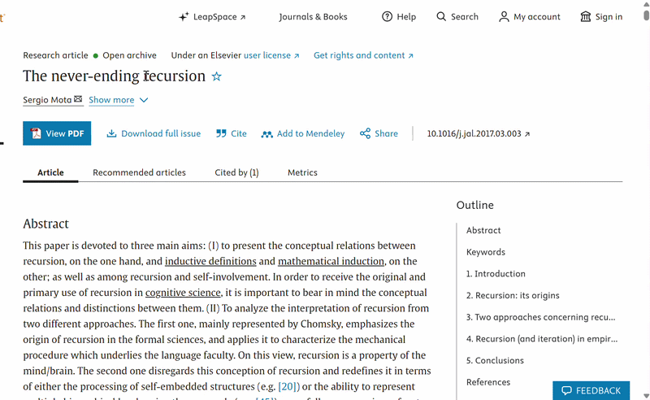

# CSimplify

**Highlight any computer science term on a webpage and get a plain-language explanation, a runnable code example, and a quick quiz, all in a sidebar.**

Built at HackWesTX (September 2026) by a team of 2.



## What it does

CSimplify is a Chrome extension for students who run into unfamiliar CS terms while reading docs, articles, or course pages. Select a term, click the button that appears, and a resizable sidebar opens with:

- **Short and detailed definitions**: a quick summary, plus a deeper technical explanation
- **An analogy** and a **real-world use case** to make the concept stick
- **A runnable Python example** that executes directly in the browser (no setup or server needed for the code itself), with a prompt suggesting one thing to change and predict
- **A knowledge-check quiz** with AI-graded feedback on your answer
- **Narration**: listen to the definition and analogy read aloud

## How it works

- **Chrome extension (JavaScript):** a content script detects highlighted text, shows the button, and renders the sidebar.
- **Python execution:** code examples run client-side using [Pyodide](https://pyodide.org) (Python compiled to WebAssembly).
- **Backend (Python, FastAPI):** three endpoints
  - `GET /define?term=...` asks an LLM (via the Backboard API) for a structured JSON definition
  - `POST /check_answer` grades a quiz answer with the LLM
  - `POST /narrate` converts text to speech with the [ElevenLabs](https://elevenlabs.io) API

## Tech stack

Python, FastAPI, JavaScript, Chrome Extensions, Pyodide (WebAssembly), Backboard API (LLM), ElevenLabs API (text-to-speech)

## Setup

### 1. Backend

```bash
git clone https://github.com/AndrewLeurs/HackW2026.git
cd HackW2026
pip install fastapi uvicorn python-dotenv pydantic elevenlabs backboard-sdk
```

> Install the Backboard client using the package name from Backboard's documentation if `backboard-sdk` differs.

Copy `env.example` to `.env` and add your keys:

```
BACKBOARD_API_KEY=your_key_here
ELEVENLABS_API_KEY=your_key_here   # optional, only needed for the Narrate button
```

Start the server (the extension expects it on port 8000):

```bash
uvicorn main:app --port 8000
```

### 2. Extension

1. Place the Pyodide files in `Extension/pyodide/` (the extension loads Python from there).
2. Open `chrome://extensions` and turn on **Developer mode**.
3. Click **Load unpacked** and select the `Extension` folder.
4. Highlight a CS term on any webpage and click the button that appears.

## What we'd improve

- Cache definitions to reduce repeat API calls
- Restrict lookups more strictly to CS and STEM terms
